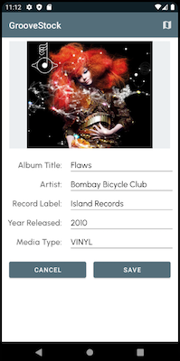

# GrooveStock
GrooveStock is a simple, clean app to keep track of your vinyl, cd's, cassettes, & mp3's. This app is being built in stages to showcase various libraries and frameworks as well as clean architecture. Each stage will add additional functionality to the application. 

## Design & Navigation.

The basic navigational flow of the app is simple: after the user logs in they are taken to the AlbumList view of their music collection. There they can add additional items to their collection by tapping the floating action button (not shown here) which takes them to the AlbumDetail page. The AlbumDetail page allows the user to add or edit properties such as album title, artist, release date, label, and media. The user can add, update, or delete items from their music collection on this page as well. An appbar button will allow the user to quickly find out which record stores are in their vicinity via a Google Maps fragment. 

 

This app uses a single Activity with three Fragments that get swapped out within a single Fragment Container using Jetpack Navigation Components.

## User Interface.
 

Google's Material Design was used as the main guiding force behind all design UI decisions. Shown here is the process of choosing color palettes from Material Design's color interface tool. 

## Stage One.
The initial stage of development includes the building of the basic skeleton of the app: Model, UI, XML layouts, Activities, Fragments, Entities, ViewModels, Database, DAOs, Repository, Navigation Components and Adapters. The idea with this stage was to assemble the main components and to give the Activities, Fragments, and RecyclerViews basic functionality. This base will be built upon in upcoming stages with added functionality. 

GrooveStock is written entirely in Kotlin using Android Studio Arctic Fox 2020.3.1. In this initial stage the data is organized by Jetpack Architectural Components in a MVVM pattern using the Room Persistence Library with all data being stored locally using SQLite. The UI was developed using Material Design practices with views being bound to Fragments using the ViewBinding library. Navigation was achieved using Jetpack Navigation Components NavGraph, NavController, and NavHost. SafeArgs were used to pass data between Fragments in a type-safe manner. All layouts were written in XML and an "include" was used in the AlbumDetailFragment layout file to house the album information section. The images used here are just filler to give an idea of what the layouts should look like when the process is finished.

## Stage Two.
Stage Two will involve building out the ViewModels for the Fragments. This will ensure that the data survives any configuration changes or system-based Activity destruction. It will also include migrating the data storage from local storage to the cloud via Retrofit2 and Firebase. Retrofit will allow the Repository to make API calls to retrieve and upload JSON files using a GSON converter. Google's Firebase will house the DataStore on a remote server. This will allow the Repository to be the single source of data manipulation within the application - interacting with both local and remote databases. Finally, a local cache of data will be configured to allow the user to use the application even when the network is down.
  
## Stage Three.
Stage Three will be all about hooking up the Application to a public API that serves Album data. At this point the Entities will be altered to work exclusively with the API which will eliminate much of the manual data entry that has existed so far in the App. Adding Albums will be much easier after this functionality is added and there will be much more information added such as Track Names, etc. In order to complete this functionality, the User Login, Token, and API key functionality will be completed.

## Stage Four.
After polishing up the app, GrooveStock will be compiled into an APK to be loaded onto the Google Play Store.
  

